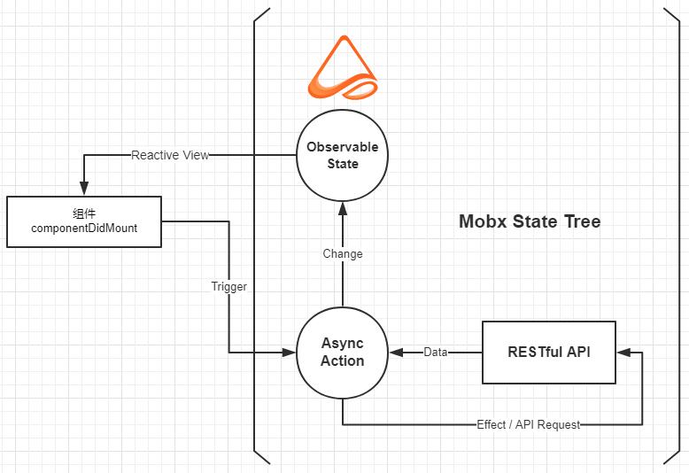

## VMatrix 微课程

> 轻量的、学生友好的、“响应式的” 课程评测客户端

[关于VMatrix](https://about.vmatrix.org.cn/)

## Preview

<div style="text-align: center;"></div>

[GIF Demo](./docs/Animation.gif)

## Todos

1. Profile Config
2. FeedBack
3. ~~Discussions~~ 3/4
4. ~~Assignments~~ 3/4
5. Service Worker

## Developer Guide

### 技术选型

- Language - Typescript
- Data Manager - [Mobx](https://github.com/mobxjs/mobx) / [Mobx-State-Tree (MST)](https://github.com/mobxjs/mobx-state-tree)
- View - [React](https://github.com/facebook/react) / [Antd UI](https://github.com/ant-design/ant-design)
- Request Tool - [Axios](https://github.com/axios/axios) with RESTful API

### 定位

- ~~SPA~~ => PWA

### 约定

- 原则：约定大于配置

### 数据流

<div style="text-align: center;"></div>

数据流中注意两点

- `Async Action` 通常是使用生成器函数, 利用MST提供的`flow(function* () {...})`获取数据

Example - Login Flow

```typescript
const LoginState = types
  .model({
    isLogin: false,
    avatarUrl: '',
    captchaUrl: ''
  })
  .named('LoginState');

// In Actions...
const LoginStore = types
  .compose(LoginState, LoadingStore)
  .actions((self: ILoginState) => {
    return {
      /**
       * Login and free previous captcha & avatar URL.
       */
      LoginAsync: flow(function* LoginAsync(body: ILoginBody) {
        const { data }: { data: ILoginResult } = yield loginPost(body);
        if (data.status === 'OK') {
          self.isLogin = true; // <== this is the "change"
          URL.revokeObjectURL(self.avatarUrl);
          URL.revokeObjectURL(self.captchaUrl);
        }
        return data;
      })
      // and other actions...
    };
  });
```

- `Change` 动作指的是 `self.someState = data`这个复制语句，而且**MST提供了运行时类型检查**

除此之外，请善用`MST`提供的`types.compose(...State)`方法来复用各种`Store`。而且在上面的例子中，`LoadingStore`利用了`MST`提供的中间件机制，在约定的情况下，可以追踪所有的以`Async`结尾的`Async Action`的运行过程，这位组件`loading`的显示提供了极大的方便，灵感来自于`dva-loading`这个`dva`插件。

### 可观察数据设计

业务相关数据放在`Store`, UI相关数据放在`class porperties`中，而且不需要用到`this.state`

特别地，`web socket`要放在MST中的`volatile`属性中，跟随MST生命周期来处理。

### 路由与代码分割

根据约定大于配置原则，路由的配置类似`Next.js`的配置，使用`pages`目录作为路由配置。不同的是，基本上每个子目录下都有`router.tsx`，用于配置当前组件的子目录路由。

拓展了`react-router-config`的`RouterConfig`接口，使其支持面包屑和`Icon`，便于`Antd`使用。

而对于代码分割，分割原则是，**以显著的低耦合性为标准**。语法层面上，封装了`react-loadable`，所以用语法

```typescript
import { dyncamic } from 'src/utils/dynamic';
const Component = dynamic(() => import('/path/to/component'));
```

即可轻易分割。

## Get Started & Install

``` bash
yarn # install deps
yarn start # start
```

## 请注意

中山大学的服务器是脆弱的，出于保护，在外网的同学请连接[中山大学PPTP VPN](http://inc.sysu.edu.cn/service/vpn-pptp)来进行开发
